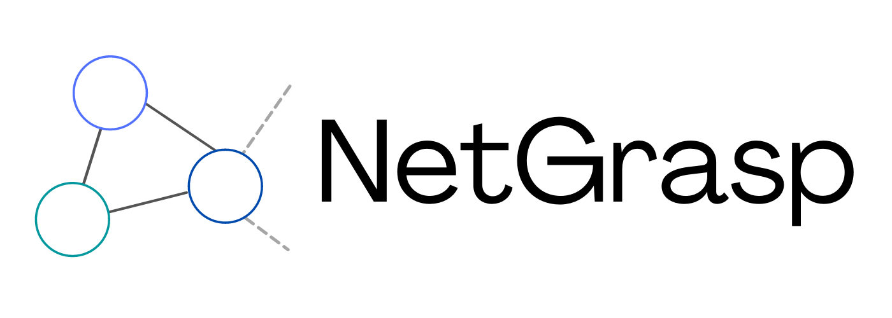

A website for viewing an internet network as a interactive diagram, with the ability to drill down and see detail but also zoom out and see the bigger picture.

[You can find a live version of the site here!](https://netgrasp.netlify.app/)

## Installation and usage

To run this project you must have node installed. You can then run

```
npm i
```

from the root directory to install the dependencies. From there you can run

```
npm start
```

to start the dev server. To build a static version of the website you can run

```
npm run build
```

which will output the built website to the `/dist` folder.

To run tests, eslint checks and typescript checks, run

```
npm run check:all
```

## Other stuff

To find out how to automatically convert your solarwinds info into a network diagram, [click here](solarwinds_export).
